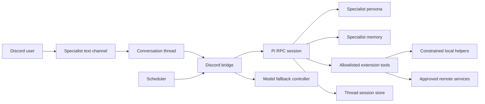

# Architecture

## Component view

## Message and session lifecycle

1. A top-level message arrives in a configured specialist text channel.
2. The bridge creates a Discord thread, gives it a short generated title, and moves the conversation into that thread.
3. The bridge maps `(specialist, thread)` to one persistent session directory.
4. It starts Pi in RPC mode with the specialist's model, reasoning level, context, extensions, and tool policy.
5. It streams safe status updates and the final response back to Discord.
6. It serializes work per thread so two turns cannot mutate the same session concurrently.
7. It stops idle Pi processes after a bounded period but keeps session state on disk.
8. A later thread message resumes the stored session.

Use strict LF-delimited JSONL for Pi RPC. Do not use a line parser that treats Unicode line separators as protocol boundaries.

## Policy layers

### Static specialist persona

Each specialist has an `AGENTS.md` containing:

- mission and scope;
- allowed and forbidden actions;
- evidence and citation expectations;
- confirmation requirements;
- domain-specific safety rules;
- response style.

The persona is configuration, not a substitute for technical enforcement.

### Shared specialist memory

A separate `memory.md` stores concise, durable facts that should apply across that specialist's threads. Conversation transcripts remain thread-specific. Memory writes should be explicit, inspectable, and reversible.

Never use shared memory as a credential store or a dumping ground for source documents.

### Tool boundary

The normal runtime starts with `--no-builtin-tools`. Extensions then expose narrow tools such as:

- bounded public web search and safe GET-only URL fetching;
- document creation and upload to the current thread;
- deterministic financial or comparison calculations;
- read-only application diagnostics from an explicit service allowlist;
- constrained spreadsheet formatting;
- guarded scheduling;
- domain-specific read-only research adapters.

A tool should validate schemas, normalize identifiers, enforce destinations, cap output, redact sensitive fields, and reject unsupported actions. A prompt saying “do not do X” is not an access-control boundary.

### Privileged maintenance role

One infrastructure specialist may receive Pi's built-in read/edit/write/shell tools. Keep it isolated from ordinary channels, document its elevated blast radius, and require focused testing before service changes.

## Attachments and outputs

The bridge can preprocess supported uploads before handing them to Pi:

- images become bounded vision inputs;
- text files are decoded with size limits;
- text PDFs are extracted;
- scanned PDFs render a bounded number of pages;
- generated files are written only to a thread-scoped output directory and uploaded back to that thread.

Apply limits before decoding or rendering. Treat filenames, document content, metadata, and embedded links as untrusted data.

## Model fallback

Configure an ordered provider/model chain. Persist the selected fallback level per thread so an idle/resumed conversation does not immediately return to a known-failing provider.

Switch only for classified persistent provider failures, such as exhausted quota, rejected credentials, unavailable models, or sustained rate limiting. Surface transient network failures and provide an explicit retry path rather than silently changing models.

Model names and prices change frequently; keep them in local runtime configuration, not in the architecture contract.

## Scheduling

Use a separate always-on scheduler for:

- one-off posts;
- daily, weekly, or monthly posts;
- threshold checks against read-only data sources;
- explicitly authorized autonomous specialist tasks.

For autonomous runs, sign the scheduled instruction with an HMAC over destination, timestamp, nonce, and body. The bridge should accept only fresh, correctly signed, bot-authored instructions and should bind execution to the originating thread.

A scheduler must not turn a previously interactive write capability into open-ended unattended authority. The exact task, destination, cadence, and allowed side effects should be approved up front.

## Integration pattern

Prefer one of these boundaries, in order:

1. A read-only public API.
2. A constrained Pi extension with a fixed schema.
3. A dedicated local helper running as its own Unix user and exposed through a permissioned Unix socket.
4. An MCP server configured with the narrowest scopes and a local deny layer for write-like tools.

Do not expose arbitrary URLs, shell commands, browser coordinates, filesystem paths, SQL, or service names through a nominally “scoped” tool.

## Reliability pattern

- systemd owns the bridge, scheduler, and isolated helpers.
- Services run as unprivileged users unless a specific operation requires more.
- Runtime files use restrictive modes and live outside the Git checkout.
- Writes use atomic replacement or file locks where concurrent access is possible.
- Helpers serialize account-sensitive operations and honor cooldown/risk responses without automated retries.
- Health checks validate the actual dependency path, not merely that a process exists.
- Logs are bounded, rotated, and redacted before model exposure.
