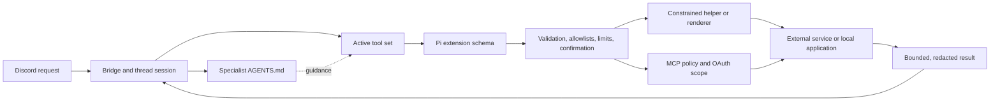

# Tool catalog and access scopes

Sanitized snapshot of the deployed tool architecture as reviewed on 2026-09-13. It documents interface names, intended users, and safety boundaries—not credentials, private endpoints, filesystem locations, account state, or user data.

The current runtime registers 37 Pi extension tools. MCP adds a general gateway and a Google Workspace namespace proxy. The Infrastructure role additionally receives four Pi built-ins. Remote MCP servers can expose dynamic sub-tools, so the exact runtime list can change after authorization or server discovery.

## Tool enforcement model

The persona guides model behavior. The active tool set, extension validation, helper protocol, service identity, network policy, OAuth scope, and confirmation gates enforce authority.

## Scope overview

```mermaid
flowchart TB
    Shared[Shared specialist tools] --> Cooking
    Shared --> Finance
    Shared --> Gardening
    Shared --> Marketplace[Marketplace research]
    Shared --> Job[Job search]
    Shared --> Shopping
    Shared --> Media[Media stack]
    Shared --> Infra[Infrastructure]
    Shared --> Travel
    Shared --> Trends
    Shared --> Project[Project evaluator]

    MarketTools[Guarded marketplace tools] --> Cooking
    MarketTools --> Gardening
    MarketTools --> Marketplace
    MarketTools --> Shopping
    MarketTools --> Project
    MarketTools --> Infra

    FinanceTools[FX and read-only brokerage] --> Finance
    FXTool[FX reference lookup] --> Project
    JobTools[CV and interview tools] --> Job
    MediaTools[Media helper actions] --> Media
    TrendTools[Trend snapshots and model baseline] --> Trends
    ProjectTools[Project calculators and research] --> Project
    Builtins[read, bash, edit, write] --> Infra
```

## Shared specialist tools

These are currently registered broadly. Personas are expected to use only relevant tools, but the roadmap includes replacing broad registration with explicit per-specialist active-tool allowlists.

### Public web

- `web_search` — bounded current-web discovery. The provider is configurable and may have a fallback. Search results are leads, not verified evidence.
- `fetch_url` — safe public HTTP(S) GET fetching for pages, text, images, and PDFs. Rejects credential-bearing URLs, nonstandard protocols, private/local destinations, and unsafe redirects; caps downloads and model-visible output.

### Memory

- `save_specialist_memory` — appends one concise durable fact to memory shared only across that specialist's threads.
- `save_memory` — optional host-wide Pi memory. Because host-wide context can cross project or role boundaries, specialist deployments should disable it or prove isolation unless that behavior is explicitly wanted.

Memory listing and deletion are exposed as commands rather than model-callable tools. Neither memory tool is suitable for credentials, source documents, transcripts, balances, addresses, or other broad personal records.

### Files and documents

- `create_pdf` — creates a general A4 PDF from bounded Markdown-like content and queues it for the current thread.
- `create_recipe_pdf` — structured print-ready recipe renderer. It is currently registered broadly but intended for cooking workflows; it accepts structured fields instead of arbitrary HTML.
- `create_text_file` — creates a supported text-based file under the current thread's output boundary.
- `upload_file_to_discord` — uploads only from the thread output directory or a restricted integration workspace.

Attachment decoding, PDF text extraction, scanned-page rendering, and Discord upload delivery are bridge capabilities, not model tools. They apply file-size, page-count, image-count, type, and destination limits before content reaches the model or Discord.

### Scheduling

- `schedule_discord_post` — creates, lists, or cancels one-off/daily/weekly/monthly posts delivered by the always-on scheduler.
- `schedule_agent_run` — creates, lists, or cancels signed autonomous runs in the originating thread. The tool is registered globally, but execution is currently allowlisted to Job Search, capped per thread, bound to a self-contained prompt, and disabled after repeated delivery failures.

A scheduled post is not an agent run. Autonomous runs require signed provenance, freshness, destination binding, replay resistance, and the same tool restrictions as interactive turns.

### Google Workspace and MCP

- `mcp` — lists, describes, authorizes, and calls configured MCP servers through the local adapter.
- `mcp__google_workspace` — namespace proxy for one Google Workspace call.
- `format_google_sheet` — submits allowlisted Sheets `batchUpdate` requests. Existing sheets receive presentation-only operations; verifiably agent-created sheets can receive a broader surface.
- `preview_google_sheet` — renders a sheet tab to an image for visual inspection after formatting.

Workspace policy keeps mail read-only and sending unavailable. External writes require an explicit request; overwrite, move/trash, sharing, permission changes, and destructive calendar actions require confirmation. MCP tool hiding, OAuth scope, server policy, and local denial must enforce this independently from the persona.

### Keyword-only marketplace discovery

- `taobao_keyword_search` — checks candidate Simplified Chinese phrases against public autocomplete and returns browser search URLs. It validates wording only and does not prove listings, stock, seller quality, delivery, or application handoff.

This tool is currently registered for all specialists so language discovery is available when relevant.

## Guarded marketplace tools

Current scope: Cooking, Gardening, Marketplace Research, Shopping, Project Evaluator, and Infrastructure.

- `taobao_product_search` — authenticated read-only desktop search cards with direct item URLs; serialized and rate-spaced.
- `taobao_product_details` — bounded inspection of one canonical product page from a user or search result; no arbitrary navigation or clicks.
- `taobao_app_lookup` — delegates one bounded official-app search and product-page check to a constrained subagent, returning a compact text verdict.
- `taobao_app_search` — one precise official-app query with numbered annotated result screenshots and short-lived search state.
- `taobao_app_product_details` — opens one numbered result, captures bounded content and variant evidence, then closes without selecting anything.

All five stop on login loss, CAPTCHA, slider, identity, or risk-control responses and never retry those responses automatically. They expose no cart, checkout, purchase, seller messaging, favorite, account, login, verification, arbitrary ADB, or arbitrary coordinate actions. Listing evidence remains seller-provided and does not independently verify authenticity, safety, stock, selected SKU, or delivery.

## Finance tools

Current scope: Finance unless otherwise noted.

- `get_fx_rate` — latest-available or historical daily reference rate and amount conversion with effective date/provider attribution. Also available to Project Evaluator.
- `schedule_fx_alert` — creates, lists, or cancels one-shot threshold alerts checked against daily reference data; not a real-time trading alert.
- `ibkr` MCP server through `mcp` — dynamically registered for Finance with read-only scope. Trade/order/instruction tools are hidden and additionally denied by local policy.

No finance tool can place, modify, or cancel an order.

## Job Search tools

Current scope: Job Search.

- `create_cv_pdf` — structured, reference-aware CV renderer with network-blocked browser rendering, overflow checks, bounded layout corrections, and an independent visual-review gate before final upload.
- `create_interview_deck` — validates and queues a role-specific practice deck through a narrow import boundary; it has no direct database access.
- `read_studio_activity` — reads bounded recent practice questions, answers, scores, and ratings for coaching. Practice claims remain unverified until separately confirmed.
- `schedule_agent_run` — currently execution-allowlisted here for explicitly approved recurring tasks.

## Media Stack tools

Current scope: Media Stack.

- `arr_lookup` — finds exact movie or series candidates before mutation.
- `arr_add` — adds one confirmed title with bounded monitoring/search settings.
- `arr_status` — returns overview, diagnosis, or queue status.
- `media_logs` — reads bounded logs from an explicit service allowlist and redacts common credentials.
- `arr_retry` — removes/blocklists a failed download and searches again; requires explicit request and confirmation.
- `arr_infrastructure` — bounded diagnose/restart/update actions for approved services; disruptive actions require confirmation.

The helper does not expose shell, arbitrary containers, compose editing, generic filesystem access, or free-form service names.

## Trends tools

Current scope: Trends and Intelligence.

- `reddit_trend_signals` — collects bounded public trend samples and retains limited snapshots for persistence comparison. Engagement is a signal, not proof.
- `current_model_stack` — reads the configured primary/fallback baseline without returning credentials.

Recommendations are advisory; these tools cannot modify the deployed model configuration.

## Project Evaluator tools

Current scope: Project Evaluator.

- `project_financial_model` — deterministic cash flow, runway, break-even, payback, capital need, and scenario arithmetic.
- `compare_supplier_quotes` — normalizes MOQ, pack rounding, FX, freight, fees, estimated duty/tax, defects, lead time, excess units, and landed cost.
- `collect_market_signals` — bounded Reddit, Hacker News, GitHub, and Wikimedia attention/activity proxies; never proof of demand or market size.
- `compare_competitors` — evidence-aware weighted criteria, missing-data reporting, and coverage thresholds.
- `search_official_sources` — official-domain discovery for jurisdiction-specific legal, regulatory, tax, registry, grant, planning, safety, privacy, employment, IP, and finance sources.
- `estimate_technology_infrastructure` — deterministic vendor-pricing, usage, growth, environment, availability, contingency, and scenario cost model.

Project Evaluator also receives `get_fx_rate` and the guarded marketplace tools. Calculators accept assumptions; they do not turn supplied values into verified facts.

## Infrastructure built-ins

Current scope: Infrastructure only.

- `read` — reads bounded text files and images available to the service identity.
- `bash` — executes host shell commands with bounded output.
- `edit` — performs exact text replacements.
- `write` — creates or overwrites files.

This is the deliberate privileged exception. The role's persona requires inspection, minimal changes, testing, reporting, and confirmation for destructive or high-impact operations, but host permissions and service configuration remain the actual boundary.

## Specialist access summary

Every role receives the shared registrations above unless a runtime policy removes them. Additional scoped access is:

- **Cooking:** guarded marketplace tools; structured recipe rendering is its primary specialized shared tool.
- **Finance:** FX lookup, FX alerts, and read-only brokerage MCP.
- **Gardening:** guarded marketplace tools.
- **Marketplace Research:** guarded marketplace tools.
- **Job Search:** CV rendering, interview deck creation, practice activity, and allowlisted autonomous runs.
- **Shopping:** guarded marketplace tools.
- **Media Stack:** six media-helper tools.
- **Infrastructure:** four Pi built-ins plus guarded marketplace tools.
- **Travel:** no additional scoped extension tools.
- **Trends and Intelligence:** public trend snapshots and deployed model baseline.
- **Project Evaluator:** six evaluation tools, FX lookup, and guarded marketplace tools.

## Bridge commands and non-tool behavior

The Discord bridge also handles commands such as help, memory list/removal, stop, retry, and new conversation. It owns thread creation, automatic titles, session persistence, attachment preprocessing, streaming, model fallback, idle process shutdown, and file delivery. These are control-plane behaviors, not LLM-callable tools.

## Why there are no production screenshots

Real Discord, browser, device, spreadsheet, and service screenshots can reveal channel names, identifiers, accounts, conversations, files, host details, or authentication state. The Mermaid diagrams above convey the access model without that exposure. Any future screenshots should come from a synthetic demo deployment with placeholder data and stripped metadata.
